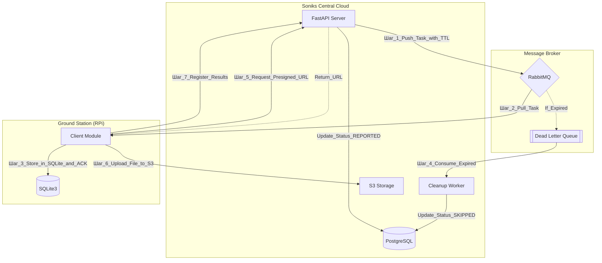
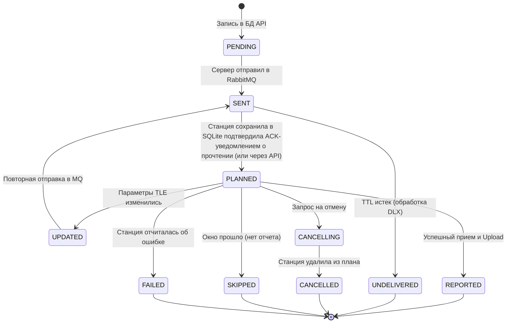

# 001. Обзор системы
Проект Soniks предназначен для мониторинга спутников через сеть распределенных наземных станций (Raspberry Pi). 
Основная задача архитектуры — обеспечить гарантированную доставку заданий на наблюдения в условиях нестабильной связи и автоматизировать сбор телеметрии.

# 002. Технологический стек
- **Backend:** Python 3.12, FastAPI, SQLAlchemy 2.0 (async), Dishka (DI).
- **Infrastructure:** PostgreSQL, RabbitMQ, Docker.
- **Background Tasks:** Taskiq.
- **Client (Station):** Python, Docker, SQLite (Local Persistence).
- **File Storage:** S3-compatible storage (MinIO/AWS/Yandex).

# 003. Схема взаимодействия

# 004. Механизмы надежности
## 4.1. Гарантированная доставка (Reliability)
- **Pull-модель**: Станции сами забирают задачи из своих персональных очередей в RabbitMQ.
- **Local Persistence**: После получения задачи станция сохраняет её в локальную БД SQLite.
- **Immediate ACK**: Подтверждение (ACK) отправляется в RabbitMQ сразу после записи в SQLite. Это освобождает очередь и гарантирует, что задача не потеряется при перезагрузке станции.

## 4.2. Жизненный цикл и протухание (TTL & DLX)
Спутники имеют строгое «окно видимости». Если станция была офлайн:
* Каждое сообщение имеет TTL (Time-To-Live), равный времени окончания пролета.
* ~~При истечении TTL сообщение попадает в Dead Letter Exchange (DLX), оттуда автоматом в DLQ (queue).~~
* ~~Серверный воркер вычитывает сообщения из DLX и помечает наблюдение в PostgreSQL как SKIPPED.~~
* При истечении TTL сообщение удаляется из очереди - RabbitMQ сам умеет удалять сообщения по TTL (заголовок `expiration`, в миллисекундах), если не указывать `x-dead-letter-exchange`, делает это автоматически, но всегда из головы очереди, последовательно, пока не дойдёт до "живого" сообщения.
* Серверный воркер   scheduler-задача будет регулярно запрашивать БД-таблицу `observations` на предмет только что истёкшего периода `observations.end_time`. Каждое FUTURE-наблюдение без актуальных загрузок в telemetries, images будет помечено `status='FAILED'`

+ [ниже: Протухание наблюдений](#ttl-ob9s)

## 4.3. Обновление параметров (Update TLE)
- При обновлении TLE сервер отправляет новое сообщение с тем же observation_id и повышенной версией (updated_at).
- Клиент выполняет Upsert в SQLite, актуализируя параметры запланированного наблюдения.

# 005. Сценарий загрузки данных (Data Ingestion)
По ходу наблюдения за спутником станция получает от него поток данных, который пишет в файлы телеметрии, изображения. Потом генерирует изображение с визуализацией сигнала - Waterfall, и audio-файл.
Для минимизации нагрузки на API-сервер используется метод прямых загрузок (upload) файлов:
- **Request**: Клиент запрашивает у API разрешение на загрузку.
- **Authorize**: API генерирует S3 Presigned URL с коротким TTL (т.е. ссылка может использоваться несколько раз, но с ограничением по времени).
- **Upload**: Клиент загружает файлы (Images, Telemetry, Waterfall) напрямую в S3.
- **Finalize**: Клиент отправляет отчет в API со списком успешно загруженных путей. Сервер обновляет метаданные в БД. 
    * возможны ситуации с потерей связи станцией, тогда в S3 остаются файлы, но API не знает об этом - вроде со стороны S3 могут генерироваться events, которые будут отслеживаться в сервере API? пока не понятно, см. ниже
    * **Уточнение claude.ai** «S3 сам может отправить уведомление в RabbitMQ»: MinIO поддерживает bucket notifications через AMQP (RabbitMQ), но это требует отдельной настройки на уровне MinIO и не является стандартным поведением. AWS S3 Event Notifications работают через SNS/SQS, не через RabbitMQ напрямую.
     **Риск:** если использоваться будет и MinIO (dev), и AWS/Yandex (prod) — механика уведомлений будет разной. Это усложняет поддержку.

## Сценарий получения Presigned Upload URL

**Зачем**: Чтобы клиент не знал секретных ключей (Access/Secret Key) от S3.
**Как**: FastAPI использует boto3 (или aioboto3), генерирует временную ссылку (например, PUT запрос к bucket/station1/file.raw?signature=...) и отдает её клиенту.
**Безопасность**: TTL ссылки должен быть коротким (например, 15–30 минут), достаточным для загрузки файла.

## Регистрация результатов в БД
Загрузка в S3 -> Вызов API для записи в БД информации о загруженных файлах.

**Риск**: Если клиент загрузил файл в S3, но в этот момент пропал интернет и он не успел дернуть API, файл в S3 станет "сиротой" (orphan file) — он там есть, но БД о нем не знает.

**Варианты**: 
1. Использовать S3 Event Notifications (если S3 поддерживает это, например MinIO или AWS). 
   S3 сам может отправить уведомление в RabbitMQ, когда файл полностью загружен, 
   тогда серверный воркер подберет это событие и обновит БД.
2. Если это слишком сложно, клиент должен присылать в API не просто "список путей", а полный отчет о завершении миссии, включая контрольные суммы (checksum) файлов.
3. __(на обсуждение с низким приоритетом)__ Чтобы компроментированная станция не могла абьюзить API редактированием / порчей чужих наблюдений, для редактируемого наблюдения нужно указывать ассоциированный с ним случайный ключ, записанный в БД API.

# 006. Статусная модель Observation (State Machine)
Для удобства обсуждения предлагается статусная модель для точного отслеживания жизненного цикла наблюдения на стороне сервера и распределенных станций.
В коде и моделях эти статусы не реализованы.

| Статус | Описание | Инициатор | Условие перехода |
| :--- | :--- | :--- | :--- |
| **PENDING** | Создана запись в БД API, ждет отправки в брокер. | Server (API/Logic) | Начальное состояние при планировании. |
| **SENT** | Задача упакована и отправлена в RabbitMQ. | Server (Taskiq) | Успешная публикация сообщения в очередь станции. |
| **PLANNED** | Доставлено и сохранено в локальную SQLite станции. | Client (RPi) + API | Станция сделала `ACK` в MQ и вызвала API-метод подтверждения. |
| **UPDATED** | Требуется повторная отправка из-за смены TLE/параметров. | Server (API) | Изменение исходных данных спутника в БД сервера. |
| **CANCELLING** | В брокер отправлена команда на удаление из плана. | Server (API) | Запрос пользователя на отмену наблюдения. |
| **CANCELLED** | Станция подтвердила удаление задачи из локальной БД. | Client (RPi) | Вызов API-метода станцией после обработки команды отмены. |
| **UNDELIVERED** | Станция не прочитала задачу (TTL в MQ истек). | Server (DLX) | Срабатывание Dead Letter Exchange в RabbitMQ. |
| **SKIPPED** | Окно наблюдения прошло, но отчета от станции нет. | Server (Worker) | Проверка по таймеру (если статус не стал REPORTED). |
| **REPORTED** | Станция успешно отчиталась о завершении. | Client (RPi) | Вызов API-метода финализации (загрузка метаданных). |

## Диаграмма переходов

### Ключевые особенности модели:
**Разделение UNDELIVERED и SKIPPED:**
* UNDELIVERED — это технический статус (проблема связи/инфраструктуры).
* SKIPPED — это логический статус (станция онлайн, но по какой-то причине не смогла инициировать процесс вовремя).

**Управление отменой (CANCELLING):**
Мы не просто удаляем запись в БД, а переводим её в CANCELLING, пока станция не подтвердит, что она выкинула задачу из своего расписания. Это предотвращает ситуацию, когда станция начинает "фантомное" наблюдение, которое сервер уже не ждет.

Если станция офлайн, когда команда отмены публикуется в очередь, TTL на команду отмены = TTL наблюдения, либо серверный воркер должен переводить CANCELLING → CANCELLED принудительно после окончания окна наблюдения.

**Цикл обновления (UPDATED):**
Статус UPDATED служит триггером для повторной отправки сообщения в брокер. Новое сообщение должно иметь тот же observation_id, чтобы клиент выполнил REPLACE или UPDATE в своей SQLite.

Обновление TLE допустимо только если `now < observation_start_time - delta`. Нужно ввести понятие «замороженного» наблюдения, которое нельзя обновлять после определённого порога

# 007. Политика публикации задач (On-Demand Generation)
Сервер придерживается стратегии «ленивой» публикации для оптимизации ресурсов брокера и актуальности данных.
- **Условие публикации**: Задачи-наблюдения не создаются и не публикуются автоматически для всех станций подряд.
- **Инициация**: Генерация пачки наблюдений происходит только по явному запросу к API:
    * `POST /api/v2/stations/{id}/observations` — планирование для конкретной станции (станция должна быть отмечена статусом ONLINE).
    * `POST /api/v2/satellites/{uuid}/observations` — планирование пролетов конкретного спутника по всей сети доступных станций.
- **Преимущество**: Это гарантирует, что в очереди RabbitMQ попадают только актуальные на момент запроса данные (TLE, частоты), и снижает количество "мертвых" сообщений в DLQ для оффлайн-объектов.

- **Настройка TTL**: Время жизни сообщения в очереди RabbitMQ должно рассчитываться динамически для каждого пролета спутника (Tend−Tstart+buffer) / связанного с ним наблюдения - задание на наблюдение теряет актуальность, если спутник уже улетел за пределы видимости.
- Сообщения с истёкшим TTL [лежат в очереди](https://www.rabbitmq.com/docs/ttl#message-ttl-applied-retroactively), пока к ней не подключится клиент/потребитель. Когда в процессе вычитывания очереди в голову подходит сообщение с истёкшим TTL, RabbitMQ автоматически помещает его в DLX->DLQ, не доставляя клиенту, переходит к следующему сообщению. 

- **Именование очередей**: Для каждой станции удобно использовать паттерн station.{id}.tasks, чтобы DLX мог возвращать метаданные о том, откуда "прилетело" протухшее сообщение. DLX должен получать `routing key` со `station_id` через заголовки (x-dead-letter-routing-key)

## Протухание наблюдений

1. Очередь RabbitMQ используем только как транспорт сообщений - не следит за сроком жизни и актуализацией наблюдения в БД.
2. Станция после успешного прочтения сообщения и принятии задания в локальный scheduler отправляет ACK-подтверждение в RabbitMQ, и HTTP-запрос-подтверждение на эндпойнт API, который обновляет статус наблюдения-задачи в БД - PLANNED (такого статуса в `ObservationStatusEnum` нет и не задумывалось - там статусы только для web-ui и API, не для управления ЖЦ задачам клиент-станций).
3. Непрочитанные из очереди сообщения лежат, пока кто-то их из неё не вычитает (или будут удалены Rabbit'ом по истечении TTL, [См. подробнее: 4.2. Жизненный цикл и протухание (TTL & DLX)](#ttl-dlx).
4. ~~Отдельный процесс (в отд. контейнере) DBTaskMonitor~~ Серверный воркер scheduler-задача будет регулярно (каждые 5 мин) запрашивать БД-таблицу observations на предмет только что истёкшего периода observations.end_time (последние 10 мин):
    - если статус FUTURE и станция не прислала телеметрию и не обновила статус наблюдения, дёргает актуализацию статуса в БД 
    - **пакетная обработка** - копим пачку.
    - (через taskiq?) update status=FAILED для всей пачки

# FIXME: Требуют проработки

103. Безопасность (VPN): В контуре VPN клиент может напрямую загружать файлы в S3 (если это self-hosted MinIO внутри сети) или через какой-то proxy-сервис.

104. Механика формирования Presigned URL через Dishka. Как внедрить клиент S3 в провайдеры и выдавать ссылки через FastAPI эндпоинт.

105. Атомарный финализатор наблюдения. Сценарий, где статус `REPORTED` выставляется только после того, как станция подтвердила успешный upload в S3 и регистрацию всех файлов в БД API. Это гарантирует, что наблюдение не будет считаться выполненным, если ещё не все данные "приземлились" в базу.

106. Структура папок в S3. Иерархия вида `/{station_id}/{date}/{observation_id}/`... для удобной навигации и автоматической очистки (Lifecycle policies).

107. Создать rabbit-пользователей по числу зарегистрированных станций - нужно как-то доставлять пароль клиенту станции:
  - есть процесс генерации API-ключа для станции-клиента.
  - станция-клиент вызывает API endpoint для генерации API-ключа `/api/v2/stations/{id}/api-key`
  - FastAPI генерирует API-ключ и возвращает его клиенту - и сразу заводит Rabbit-пользователя с паролем равным этому ключу.
  - API-ключ не хранится в БД в открытом виде - есть поле stations.hash_api_key, который для Rabbit-пользователя ничем не поможет. Скомпроментировал пароль / API-ключ - Rabbit-пользователь не сможет подключиться. Тогда нужно получать новый API-ключ, обновлять Rabbit-пользователя и т.д.

      - каждая станция при регистрации получает уникальный токен, который можно использовать как пароль для тут же создавамого rabbit-пользователя `station_{id}`
      - каждый такой пользователь `station_{id}` получает permissions по регулярке с соответствующим суффиксом `.*\.station\.{id}\..*`
 
  - с rabbit-юзер-паролем клиент станции будет иметь возможность вычитывать только свою очередь, без возможности испортить/вычитать задания для другой станции - не смогут портить жизнь друг другу, случайно/умышленно, полностью доверять внешним коннектам мы не имеем права

  - минимально проверил эту схему с разделением доступов по клиентам-очередям - вроде работает
