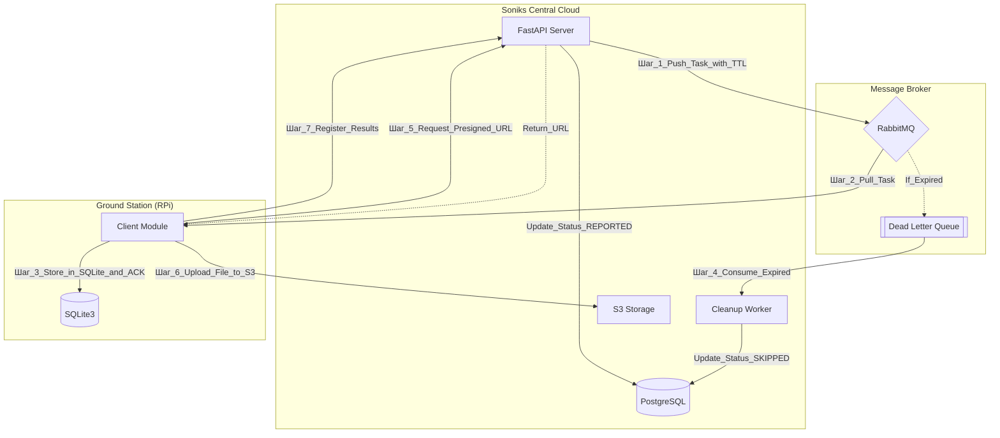

# 001. Обзор системы
Проект Soniks предназначен для мониторинга спутников через сеть распределенных наземных станций (Raspberry Pi). 
Основная задача архитектуры — обеспечить гарантированную доставку заданий на наблюдения в условиях нестабильной связи и автоматизировать сбор телеметрии.

# 002. Технологический стек
- **Backend:** Python 3.12, FastAPI, SQLAlchemy 2.0 (async), Dishka (DI).
- **Infrastructure:** PostgreSQL, RabbitMQ, Docker.
- **Background Tasks:** Taskiq.
- **Client (Station):** Python, Docker, SQLite (Local Persistence).
- **File Storage:** S3-compatible storage (MinIO/AWS/Yandex).

# 003. Схема взаимодействия (Mermaid)

# 004. Механизмы надежности
## 4.1. Гарантированная доставка (Reliability)
- **Pull-модель**: Станции сами забирают задачи из своих персональных очередей в RabbitMQ.
- **Local Persistence**: После получения задачи станция сохраняет её в локальную БД SQLite.
- **Immediate ACK**: Подтверждение (ACK) отправляется в RabbitMQ сразу после записи в SQLite. Это освобождает очередь и гарантирует, что задача не потеряется при перезагрузке станции.

## 4.2. Жизненный цикл и протухание (TTL & DLX)
Спутники имеют строгое «окно видимости». Если станция была офлайн:
* Каждое сообщение имеет TTL (Time-To-Live), равный времени окончания пролета.
* При истечении TTL сообщение попадает в Dead Letter Exchange (DLX).
* Серверный воркер вычитывает сообщения из DLX и помечает наблюдение в PostgreSQL как SKIPPED.

## 4.3. Обновление параметров (Update TLE)
- При обновлении TLE сервер отправляет новое сообщение с тем же observation_id и повышенной версией (updated_at).
- Клиент выполняет Upsert в SQLite, актуализируя параметры запланированного наблюдения.

# 005. Сценарий загрузки данных (Data Ingestion)
По ходу наблюдения за спутником станция получает от него поток данных, который пишет в файлы телеметрии, изображения. Потом генерирует изображение с визуализацией сигнала - Waterfall, и audio-файл.
Для минимизации нагрузки на API-сервер используется метод прямых загрузок (upload) файлов:
- **Request**: Клиент запрашивает у API разрешение на загрузку.
- **Authorize**: API генерирует S3 Presigned URL с коротким TTL (т.е. ссылка может использоваться несколько раз, но с ограничением по времени).
- **Upload**: Клиент загружает файлы (Images, Telemetry, Waterfall) напрямую в S3.
- **Finalize**: Клиент отправляет отчет в API со списком успешно загруженных путей. Сервер обновляет метаданные в БД.

# 006. Статусная модель Observation (State Machine)
В системе используется расширенная статусная модель для точного отслеживания жизненного цикла наблюдения на стороне сервера и распределенных станций.
| Статус | Описание | Инициатор | Условие перехода |
| :--- | :--- | :--- | :--- |
| **PENDING** | Создана запись в БД API, ждет отправки в брокер. | Server (API/Logic) | Начальное состояние при планировании. |
| **SENT** | Задача упакована и отправлена в RabbitMQ. | Server (Taskiq) | Успешная публикация сообщения в очередь станции. |
| **PLANNED** | Доставлено и сохранено в локальную SQLite станции. | Client (RPi) + API | Станция сделала `ACK` в MQ и вызвала API-метод подтверждения. |
| **UPDATED** | Требуется повторная отправка из-за смены TLE/параметров. | Server (API) | Изменение исходных данных спутника в БД сервера. |
| **CANCELLING** | В брокер отправлена команда на удаление из плана. | Server (API) | Запрос пользователя на отмену наблюдения. |
| **CANCELLED** | Станция подтвердила удаление задачи из локальной БД. | Client (RPi) | Вызов API-метода станцией после обработки команды отмены. |
| **UNDELIVERED** | Станция не прочитала задачу (TTL в MQ истек). | Server (DLX) | Срабатывание Dead Letter Exchange в RabbitMQ. |
| **SKIPPED** | Окно наблюдения прошло, но отчета от станции нет. | Server (Worker) | Проверка по таймеру (если статус не стал REPORTED). |
| **REPORTED** | Станция успешно отчиталась о завершении. | Client (RPi) | Вызов API-метода финализации (загрузка метаданных). |

## Диаграмма переходов

```mermaid
stateDiagram-v2
    [*] --> PENDING: Запись в БД API
    
    PENDING --> SENT: Taskiq отправил в RabbitMQ
    
    SENT --> PLANNED: Станция сохранила в SQLite\nи подтвердила через API
    SENT --> UNDELIVERED: TTL истек (обработка DLX)
    
    PLANNED --> UPDATED: Параметры TLE изменились
    UPDATED --> SENT: Повторная отправка в MQ
    
    PLANNED --> CANCELLING: Запрос на отмену
    CANCELLING --> CANCELLED: Станция удалила из плана
    
    PLANNED --> REPORTED: Успешный прием и Upload
    PLANNED --> SKIPPED: Окно прошло (нет отчета)
    PLANNED --> FAILED: Станция отчиталась об ошибке
    
    REPORTED --> [*]
    UNDELIVERED --> [*]
    CANCELLED --> [*]
    SKIPPED --> [*]
    FAILED --> [*]
```

### Ключевые особенности модели:**
**Разделение UNDELIVERED и SKIPPED:**
* UNDELIVERED — это технический статус (проблема связи/инфраструктуры).
* SKIPPED — это логический статус (станция онлайн, но по какой-то причине не смогла инициировать процесс вовремя).

**Управление отменой (CANCELLING):**
Мы не просто удаляем запись в БД, а переводим её в CANCELLING, пока станция не подтвердит, что она выкинула задачу из своего расписания. Это предотвращает ситуацию, когда станция начинает "фантомное" наблюдение, которое сервер уже не ждет.

**Цикл обновления (UPDATED):**
Статус UPDATED служит триггером для повторной отправки сообщения в брокер. Новое сообщение должно иметь тот же observation_id, чтобы клиент выполнил REPLACE или UPDATE в своей SQLite.
